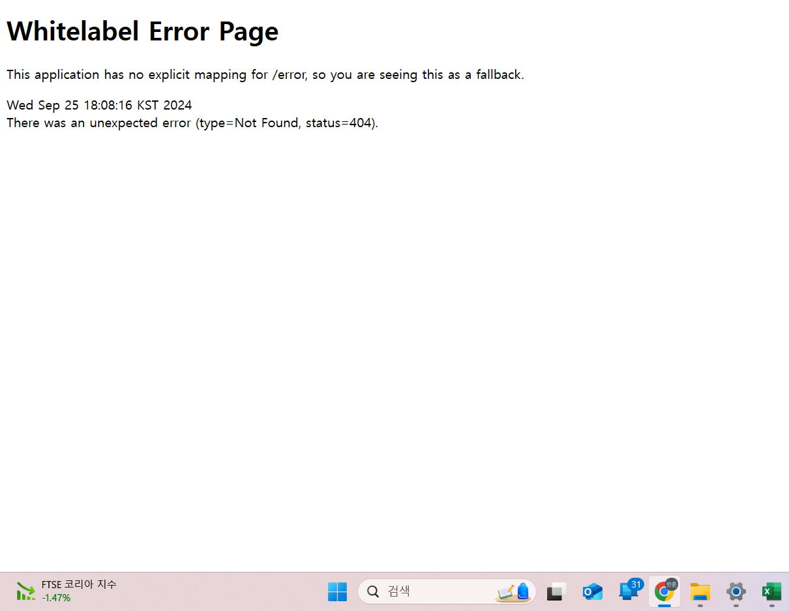

# 웹
## 클라이언트-서버
### 클라이언트
데이터의 생성/조회/수정/삭제 요청을 전송
### 서버
요청대로 동작을 수행하고 응답을 전송

## 프로토콜: HTTP
### HTTP Request
- `METHOD` + `URL`
	- `METHOD`: 데이터 요청 종류
		- `GET` : 조회
		- `POST` : 새로생성
		- `PUT` : 덮어쓰기
		- `PATCH` : 수정
		- `DELETE`: 삭제
	- `URL`: 데이터 위치
		- ex: `http://www.example.com/user/2/name?type=nickname`
		- `http://`: 프로토콜
		- `www.example.com/user/2/name` : URL
			- path parameter 사용: `www.example.com/user/{user_id}/name`
		- `?type=nickname` : 쿼리스트링
### HTTP 바디
- HTML 소스를 받거나(text) JSON 으로 받음
### HTTP Status Code
- 200: OK
- 201: Created
- 400: Bad request
- 404: Not found
- ...
# Frontend / Backend
- 브라우저: 페이지 받아옴
- 프론트: 페이지에서 서버에 데이터 요청
- 백엔드: 프론트에서 요청한 데이터 전달
# API
- 프론트가 백엔드에 요청을 보낼 때 어떻게 응답할지 정해놓은 것
	- 프로토콜
	- 메소드
	- URL
## 투두메이트 클론코딩 api 명세
- 회원가입
	`GET` /register
- 로그인
	`GET` /login
- 할일
	/{user_id}/todo
	- 할일 조회: `GET` /{user_id}/todo/list
	- 할일 생성: `POST` /{user_id}/todo/
	- 할일 수정: `PATCH` /{user_id}/todo/{todo_id}
	- 할일 삭제: `DELETE` /{user_id}/todo/{todo_id}
	- 할일 체크/체크해제: `POST` /{user_id}/todo/{todo_id}/toggle
	- 카테고리 추가: `POST` /{user_id}/todo/category
	- 키테고리 삭제: `DELETE` /{user_id}/todo/{category_id}
- 친구: /{user_id}/friends
	- 친구 추가: `POST` /{user_id}/friends/add
	- 친구 조회: `GET` /{user_id}/friends/list
	- 친구 삭제: `DELETE` /{user_id}/friends/{friend_id}
	- 특정 친구 할일 조회: `GET` /{friend_id}/todo/list

