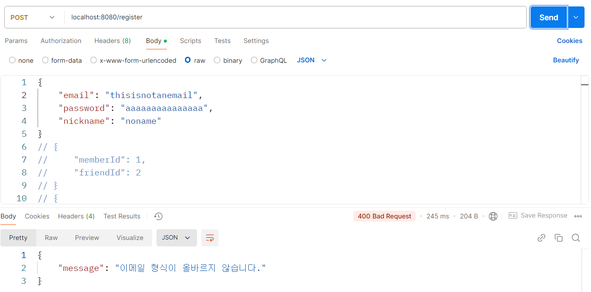
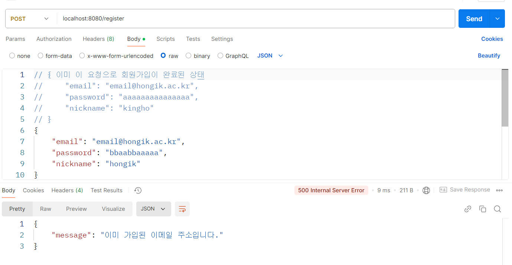

### 유효성 검사
- 200자 넘는 내용을 보내면 `500 internal server error`가 됨
- db까지 가서 검사하는건 오버헤드
#### dto에서 검사하기
- 형식만 검사 가능
```java
// dto
@Getter  
public class MemberCreateRequest {  
	@NotNull
	@Length(min = 1, max = 320, message = "길이는 320자를 넘길 수 없습니다.")
    @Pattern(regexp = "^[^@]+@([a-zA-Z0-9]+\\.)+[a-zA-Z0-9]+$")  
    private String email;  
    private String password;  
    private String nickname;  
}
```
### 예외 처리
- 오류가 나도 클라이언트가 뭔 오류인지 모름
#### `GlobalExceptionHandler` 클래스
- 자바 전역에서 나오는 오류 처리
```java
@ControllerAdvice
public class GlobalExceptionHandler {
	// Exception 클래스 오류가 나면 대신 처리
	// Bad request -> BadRequestException
	// DTO argument error -> MethodArgumentNotValidException
	@ExceptionHandler(value = Exception.class)
	public ResponseEntity<ErrorResponse> handleUnknownError(Exception ex) {
		// ...	
	}
}
```
## AOP
- 각 컨트롤러의 역할은 달라도 겹치는 기능들 (오류 처리 등)이 있음
- 이런 공통관심사를 관점(aspect)라고 함
	- Joint point: 실행 중 발생하는 교차점
	- Advice: 특정 joint point에서 실행하는 동작
## 커스텀 에러 적용 결과
- 이메일 주소 형식 오류

- 이미 가입된 이메일 주소
