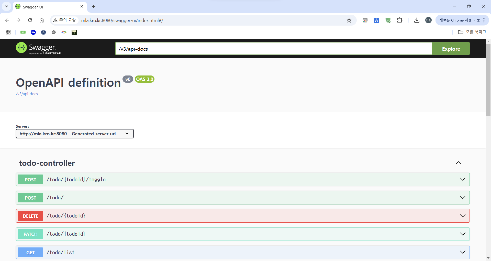

## 배포
### API 문서화
- `spring doc`이 `Open-API`규격으로 `Swagger-ui` 적용해서 알아서 해줌
### 프로젝트 배포
- 빌드해서 서버로
    - `./gradlew build`로 빌드
    - `java -jar ./build/libs/todo-api-0.0.1-SNAPSHOT.jar`로 실행
- 빌드된 `.jar` 파일만 실행하면 의존성 문제 없이 실행할 수 있음
### 실제 배포
[http://mla.kro.kr:8080/swagger-ui/index.html#/]
