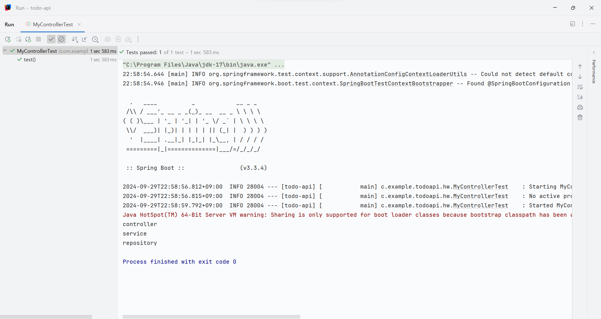

### 스프링
- 백엔드 프레임워크
- 객체지향 원칙
- **스프링부트**: 프레임워크 개발 도구, 내장 웹서버 제공
#### 어플리케이션 구조
- 외부에서 http 요청
- **내장 서버**에서 **스프링 컨테이너**의 전용 **컨트롤러**로 전달
- **컨트롤러**는 **DB** 접근
- JSON에 담아서 **내장 서버**로 보냄
#### 스프링 빈(Bean)
- 어플리케이션 전역에서 사용할 공용 객체
- 스프링 **빈**이 **빈**을 요청하면 스프링 프레임워크가 자동으로 가져다줌
#### 스프링 컨테이너
= 어플리케이션 컨테이너
- 스프링 빈이 저장되는 공간
#### 빈 조작
##### 설정
1. 설정파일 작성: 하나의 설정파일에 명시
	- 설정파일은 `@Confiuration` 어노테이션을 포함한 자바 클래스
	```java
	import ...
	
	@Configuration // 설정파일임을 의미
	public class TestConfig {  
	    @Bean // 빈으로 등록될 객체임을 의미
	    public MyBean myBean() {  
	        return new MyBean();  
	    }  
	}
	```
2. 컴포넌트 스캔: 
	- `@Component` 어노테이션이 붙은 클래스를 찾아 빈으로 등록
	```java
	// 이 클래스는 빈으로 등록됨
	@Component
	public class ... {}
	```
	- `@ComponentScan` 어노테이션이 붙은 클래스에서 컴포넌트 스캔 진행
	```java
	// 이 클래스가 동작할때 컴포넌트를 스캔함
	@ComponentScan
	public class ... {}
	```
##### 의존성 주입
- 빈을 사용할 때 꺼내오는게 아니라 가져다달라고 프레임워크에 요청
- OCP 원칙을 준수하기 위해 의존성 주입
- 생성해둔 객체를 사용하므로 메모리 효율적
- **의존성**
	- A 클래스가 B 클래스의 기능을 필요로한다면 A는 B에 의존
- **주입**
	- 의존하는 클래스의 객체를 외부로부터 받아야 함
- 주입 방법
	- **생성자주입**: 생성자에 `@Autowired` 어노테이션을 붙여 주입 생성자 명시
		```java
		public class MyBean {
			private final MySubBean mySubBean;
			@Autowired
			public MyBean(MySubBean mySubBean) {
			}
		}
		```
	- `lombok.RequiredArgsConstructor`: 클래스에 `@RequiredConstructor`어노테이션 사용하면 생성자 알아서 처리
		```java
		@RequiredArgsConstructor
		public class MyBean {}
		```
	- **필드주입**: 인라인에서 주입하도록 함. 그 부분에 `@Autowired`어노테이션 추가. 테스트에서 사용
        ```java
        ...
        @Autowired
        private MySubBean mySubBean
        ```
# 과제
