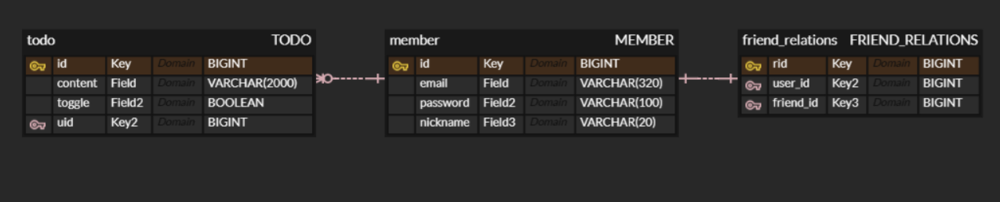

# DB 설계
## ER model
- 개체: 테이블
- 관계: 테이블 or 외래키
- 속성: 개체와 관계는 속성을 가짐
- **P**rimary **K**ey: 개체를 식별할 수 있는 속성
- 개체와 개체 사이의 관계
    - 식별 관계 : 관계 대상의 PK를 자신의 PK로도 사용하는 것
    - 비-식별 관계 : 관계 대상의 PK를 자신의 FK로만 사용하는 것
- 엔티티 연관관계
    - 일대일
    - 일대다
    - 다대일
    - 다대다
## JPA
- DB 테이블을 자바 객체로 다룰 수 있게 해주는 API
- DB의 구성요소는 다음과 같이 매핑됨
    - 테이블 : 엔티티 클래스
    - 레코드 : 엔티티 객체
    - 칼럼 : 엔티티 클래스의 필드
- JPA는 엔티티 클래스에 대한 SQL을 알아서 작성해줌
    - 편하다!
### 엔티티 클래스 작성
#### 어노테이션
- JPA 관련 어노테이션
- `@Entity`: 클래스가 엔티티 클래스임을 표시
- `@Id`: 이 필드가 Primary Key임을 표시
- `@GeneratedValue()`: DB가 자동으로 값을 정하도록 함
    - `strategy` =
        - `GenetationType.AUTO`: DB가 알아서 함
        - `GenerationType.IDENTITY`: 자동으로 증가하는 숫자
- `@Column`: 칼럼 명시하는 어노테이션
    - `name`: 칼럼 이름
    - `columnDefinition`: SQL 자료형을 명시적으로 지정
- 관계 관련 어노테이션
- `@JoinColumn(name)`: 외래키 칼럼을 명시
- `@OneToOne`: 일대일 연관관계 (`@JoinColumn`에 붙여서 씀)
- `@ManyToOne`: 다대일 연관관계 (`@JoinColumn`에 붙여서 씀)
    - `fetch`
        - `FetchType.LAZY`: 연결된 객체의 정보를 필요할 때 가져옴
        - `FetchType.EAGER`: 이 객체에 대한 정보를 가져올 때 연결된 객체의 모든 정보를 가져옴
- 기타
- `@Getter`: 모든 필드에 getter 메소드 생성
- `@NoArgsConstructor`: 인자없는 생성자 생성
    - `access`: 접근제한자 설정
        - `AccsessLevel.PROTECTED`; `protected` 접근 지정자
#### 코드
```java
@Entity
@Getter
@NoArgsConstructor(access = AccessLevel.PROTECTED)
public class Todo {
    @Id
    @GeneratedValue(GenerationType.IDENTITY)
    @Column(name = "tid")
    private Long id;
    
    @Column(name = "todo_content", columnDefinition = "varchar(200)")
    private String content;

    //...

    // Constructor
    public Todo(
        String content,
        // ...
    ) {
        this.content = content;
        // ...
    }
}
```

# TODO ERD
